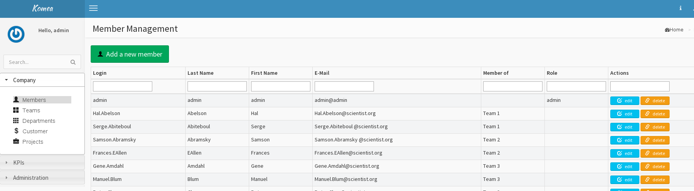
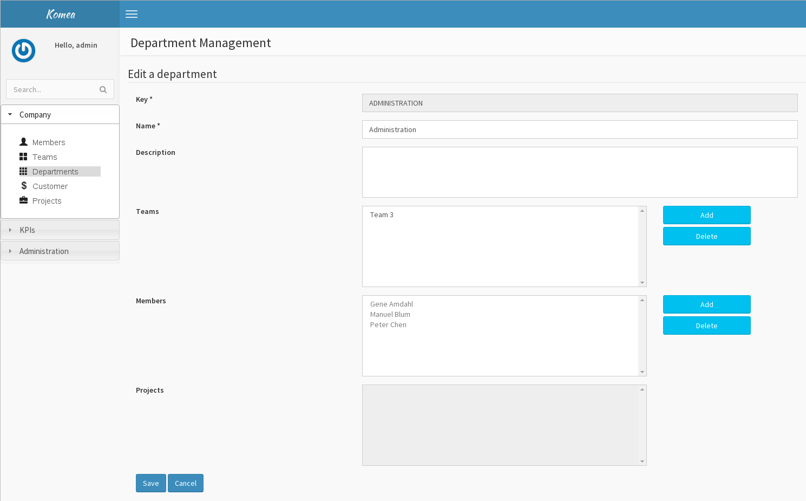
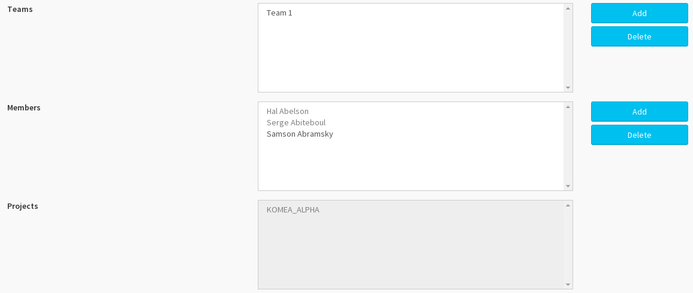
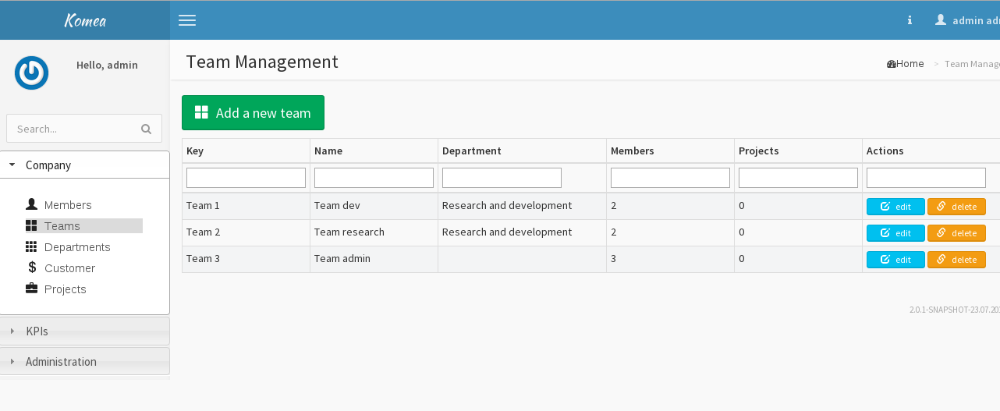
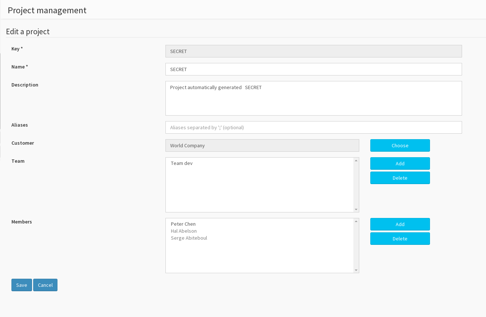
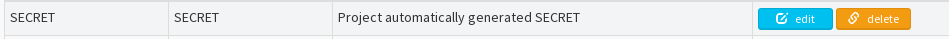

Document :

User documentation for the komea administration

#Description 

#Connexion 

Only administrators can connect to the Komea administrations page.

Enter your administrator login and password to access to the ‘Komea
administration home page’.

# Manage yout company with komea 

## Manage members 

### List members 

To access to the user list, From the Komea home page, click on one of
the ‘Members’ button which are placed on the shortcut panel in the
center panel or in the navigation panel on the left :

Then the Komea user administration page must be loaded:

[IMAGE]

### Create a new member 

You can create a new member, you can:

1.  User the user administration page

2.  Or import them with LDAP (see section [LDAP
    configuration](#_LDAP_configuration))

To create a member with the ‘Members administration’ page, click on the
‘Add a new member’ button, then the ‘Member creation’ page must be
loaded.

A member has:

-   A login (required field) you can change then only in new create

-   A first name (required field)

-   A last name (required field)

-   An email (required field)

-   A member origin (not editable) to inform how the member has been
    created

-   KOMEA if the member has been created from the member administration
    page

-   LDAP if the member has been imported from LDAP

-   The team or department the member is associate (optional). If you
    add or remove associate group, the link is create or delete. Then
    you can see the link in team and department page too

-   Projects the user is associate (optional). Same comportment that
    before field with project

\

Enter the new member information and press the ‘Save’ button.

#### Create an administrator 

To create a new administrator just check the ‘admin’ checkbox and enter
a password (5 characters minimum).

.

### Delete a member 

To delete a member, just click on the delete button of a member in the
‘member administration’ page.

### Show/edit member details 

To show informations on a member, just click on the ‘edit’ button. The
‘Member edit’ page must be loaded. After editing information, Click on
the ‘save’ button.

#### Transform a simple user in administrator 

You can transform a simple member in administrator in checking the
‘admin’ checkbox and write a password.

To transform an administrator in simple member, just uncheck the ‘admin’
checkbox.

##Manage departments 

### List departments 

To access to the user list, From the Komea home page, click on one of
the ‘Departments’ button which are placed on the shortcut panel in the
center panel or in the navigation panel on the left. Then the Komea
department administration page must be loaded:

### Create a new Department 

To create a new department with the ‘Departments administration’ page,
click on the ‘Add a new department’ button, then the department creation
page must be loaded.

A department has:

-   A key (required)

-   A name (required)

-   A descriptions (optional)

-   Can contain teams (optional)

-   Can contain members (optional)

-   Display projects associate in teams and/or members (view)

Some details on team members and project :

You can add team only if the team is not associate to another
department.

You can add members only if the member is not associate to another
department or a team, you see them members associate in department’s
team. Here “Hal” and “Serge” you cannot remove directly then bug if your
remove “Team 1” members of this team will also remove.

There are a view of project that cannot be change. You can see all
project associate members and/or team of this department

### Delete a department 

To delete a department, just click on the delete button of a department
in the ‘Departments administration’ page.

### Show/edit department details 

To show informations on a department, just click on the ‘edit’ button.
The ‘Departments edit’ page must be loaded. After editing information,
Click on the ‘save’ button.

##Manage teams 

### List teams 

To access to the team list, From the Komea home page, click on one of
the ‘Teams’ button which are placed on the shortcut panel in the center
panel or in the navigation panel on the left. Then the Komea ‘Teams
administration’ page must be loaded:

### Create a new team 

To create a new team with the ‘Teams administration’ page, click on the
‘Add a new department’ button, then the team creation page must be
loaded.

A department has:

-   A key (required)

-   A name (required)

-   A descriptions (optional)

-   Can contain other teams (optional)

### Delete a team 

To delete a team, just click on the delete button of a team in the
‘Teams administration’ page.

### Show/edit team details 

To show informations on a team, just click on the ‘edit’ button. The
‘Team edit’ page must be loaded. After editing information, Click on the
‘save’ button.

##Manage projects 

### List projects 

To access to the project list, From the Komea home page, click on one of
the ‘Projects’ button which are placed on the shortcut panel in the
center panel or in the navigation panel on the left. Then the Komea
‘Projects administration’ page must be loaded:

### Create a new project 

To create a new project with the ‘Projects administration’ page, click
on the ‘Add a new project ‘button, then the ‘Project creation’ page must
be loaded.

A project has:

-   A key (required)

-   A name (required)

-   A descriptions (optional)

-   Can define aliases (optional). Used for link multiple project to one

-   Can be associate with customer (optional)

-   Can be associate with teams (optional)

-   Can be associate to members (optional)

### Delete a project 

To delete a project, just click on the delete button of a project in the
‘Projects administration’ page.

### Show/edit project details 

To show informations on a project, just click on the ‘edit’ button. The
‘Project edit’ page must be loaded. After editing information, Click on
the ‘save’ button.

##Manage customers 

### List customers 

To access to the customers list, From the Komea home page, click on one
of the ‘Customers’ button which are placed on the shortcut panel in the
center panel or in the navigation panel on the left. Then the Komea
‘Customers administration’ page must be loaded:

### Create a new customers 

To create a new customer with the ‘Customers administration’ page, click
on the ‘Add a new customer ‘button, then the ‘Customer creation’ page
must be loaded.

A customer has:

-   A name (required)

### Delete a customer 

To delete a customer, just click on the delete button of a project in
the ‘Customers administration’ page.

### Show customer details 

To show informations on a customer, just click on the ‘edit’ button. The
‘Customers edit’ page must be loaded. After editing information, Click
on the ‘save’ button.

# KPIs and alerts 

## KPIs 

### List KPIs 

To access to the KPIs list, From the Komea home page, click on one of
the ‘KPIs’ button which are placed on the shortcut panel in the center
panel or in the navigation panel on the left. Then the Komea ‘KPIs
administration’ page must be loaded:

### Delete a KPI 

To delete a KPI, just click on the delete button of a project in the
‘KPI administration’ page.

### Show/edit KPI details 

To show informations on a KPI, just click on the ‘edit’ button. The
‘Customers edit’ page must be loaded:

A kpi is describe with

-   A name (required)

-   The description (optional)

-   A group formula (required)

-   Type of value (required)

-   Minimum value (required)

-   Maximum value (required)

-   Type of kpi (required)

-   Direction (required)

-   Scope of kpi (required)

-   The formula to calculate the KPI. To write a formula, see section
    [Edit kpi Formula](#_Edit_kpi_Formula)

-   Number of kpi value (information field). It can cleared with a
    button “clear history” this action remove all of history of kpi
    value

After editing information, Click on the ‘save’ button.

### Create a new KPI 

To create a new project with the ‘KPI administration’ page, click on the
‘Add a new KPI ‘button, then the ‘KPI creation’ page must be loaded.
Fill the different fields as describe in the precedent sections

## Alerts 

### List alert 

To access to the alert list, From the Komea home page, click on one of
the ‘Alerts’ button which are placed on the shortcut panel in the center
panel or in the navigation panel on the left. Then the Komea ‘Alert
administration’ page must be loaded:

### Create a new alert 

To create a new project with the ‘Alert administration’ page, click on
the ‘Add a new a alert ‘button, then the ‘Alert creation’ page must be
loaded.

A project has:

-   A key (required)

-   A name (required)

-   A descriptions (optional)

-   The KPI which it is associate

-   The alert severity (INFO, MINOR, MAJOR, CRITICAL, BLOKER)

-   The condition to launch an alert ( ex : \< 60% for a code coverage
    KPI)

-   A checkbox to activate it.

### Delete alert 

To delete an alert, just click on the delete button of a project in the
‘Alert administration’ page.

### Show/edit alert details 

To show informations on an alert, just click on the ‘edit’ button. The
‘Alert edit’ page must be loaded. After editing information, Click on
the ‘save’ button.

# Edit kpi Formula 

Formula are …

There are five kinds of KPI:

-   KPI to find the last value for an event type

-   KPI to count number of received events for an event type

-   KPI for Testlink

-   KPI for SonarQube

-   KPI for Bugzilla

-   Each kind of KPI has these have a particular syntax. However, all
    these formula use java classes.

### Find the last value for an event type 

To calculate the last value for a particular event type filter by
projects

Syntax:

new org.komea.product.plugins.kpi.standard.LastEventValueKpi(String
eventTypeKey)

-   eventTypeKey : The key oh the event type we want to count the events

Example:

new
org.komea.product.plugins.kpi.standard.LastEventValueKpi(“build\_industrialization”)

This KPI return the current industrialization value of each projects

### Return the number Count number of received events for an event type 

To calculate the number of event for an event type since a period filter
by projects

Syntax:

new org.komea.product.plugins.kpi.standard.EventsCountKpi(String
eventTypeKey, int time, String unit)

-   eventTypeKey : The key oh the event type we want to count the events

-   unit : The time period (possible values are “SECONDS”, “MINUTES”,
    “HOURS”, “DAYS”)

-   time, the number of ‘unit’

-   Example:

new
org.komea.product.plugins.kpi.standard.EventsCountKpi(“analysis\_started”,
6, “DAYS”)

-   

This formula calculate of launched analysis in sonar since 6 days by
projects

### KPI for Testlink 

To calculate the number of test case from Testlink with a particular
status filter by projects.

Syntax:

new org.komea.product.plugins.testlink.core.TestsByStatusKPI(String
status)

-   status : the status filter(possible values are “NOT\_RUN”, “PASSED”,
    “FAILED”, “BLOCKED”

-   Example :

new org.komea.product.plugins.testlink.core.TestsByStatusKPI(“PASSED”)

-   This KPi calculate the number of success tests in Testlink by
    projects

### KPI for SonarQube 

-   To have the last metric value of a sonar metric by projects

new org.komea.product.plugins.kpi.standard.SonarMetricKpi(String
metricKey)

-   The sonar metric key. You can find the sonar metric keys list in
    your sonar server at this url:
    http://\<YOUR\_SONAR\_dOMAIN\>/api/metrics.

-   Example:

new
org.komea.product.plugins.kpi.standard.SonarMetricKpi(“branch\_coverage”)

-   This KPI calculate the current branch coverage for each projects.

### KPI for Bugzilla 

To have statistics on Bugzilla bugs filters by projects. Four parameters
for filters of bugs:

-   status: the bug status (open, resolved, closed…)

-   resolution: the bug resolution (new, assigned, fix…)

-   severity (minor, major, crashed…)

-   priority (low, normal, urgent…)

All these values can change because the Bugzilla administrator decides
them.

Syntax:

new org.komea.product.plugins.bugzilla.core.BZBugCountKPI(String
searchs)

-   Search: the research criterias.

#### The research criterias 

Research criteria are simple logical expression based on these
operators:

-   ‘;’ : the AND operator

-   ‘\#’: the OR operator

-   ‘=’ the EQUAL operator

-   ‘!=’ the DIFFERENT operator

-   ‘,’ : the separator for possible values

Example:

“status!=closed;resolution!=fixed,priority=urgent,immediate

This criterion find all no closed and not fixed bugs, which have a
priority urgent or immediate.

# Komea administration 

## LDAP configuration 

To configure the Testlink plugin, go to the ‘Administration’ 
‘plugins’.

Then click on the ‘admin’ button of the LDAP plugin to load the ‘LDAP
management’ page and fill these fields:

-   ldap-server: The LDAP url

-   ldap\_userDn: the login to access LDAP

-   ldap\_password: the password to access LDAP

-   ldap\_authType: possible values are : “Simple”, “Simple tls”, “Tls
    certificate” and “Digest md5”

-   ldap\_base: “dc=com,dc=Tocea” for exemple

### Testlink configuration 

See the Testlink user documentation

### Bugzilla configuration 

See the Bugzilla user documentation

© 2014 – Confidentiel Tocea Komea – User Guide Page 19 / 21

